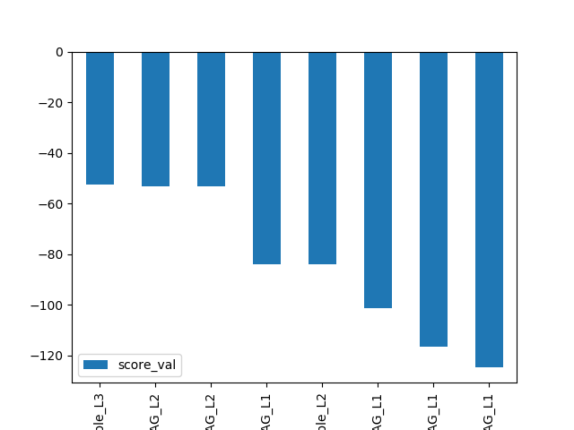
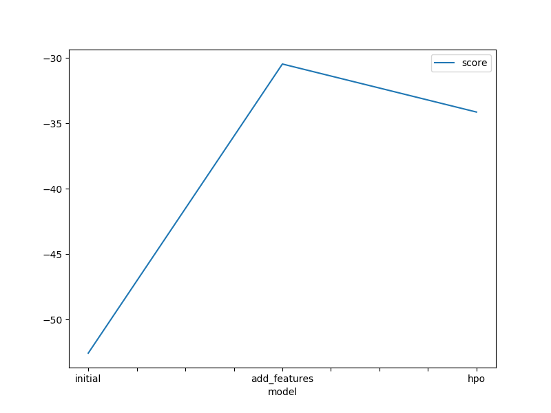
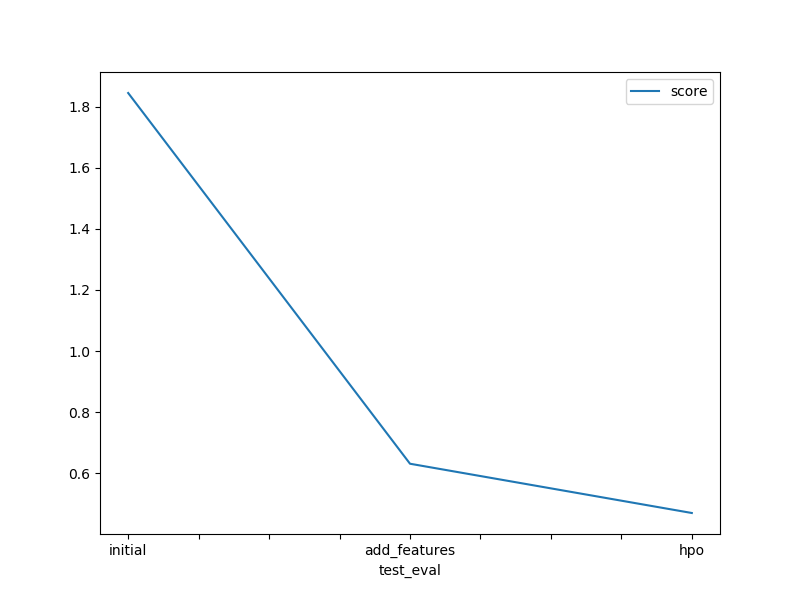

# Report: Predict Bike Sharing Demand with AutoGluon Solution

You are provided hourly rental data spanning two years. For this competition, the training set is comprised of the first 19 days of each month, while the test set is the 20th to the end of the month. You must predict the total count of bikes rented during each hour covered by the test set, using only information available prior to the rental period.

#### Diego Arinze Uchendu

## Initial Training
### What did you realize when you tried to submit your predictions? What changes were needed to the output of the predictor to submit your results?

I realized that I must create a count column in submission dataframe and assign my preditions to this column.
```py
submission["count"] = predictions
submission.to_csv("submission.csv", index=False)
```

I also made sure that my predictions valus are > 0 else Kaggle will reject it.
```py
# Describe the `predictions` series to see if there are any negative values
predictions[predictions<0].count()
```

### What was the top ranked model that performed?



As seen above, the top scores are visualized first with WeightedEnsemble_L3 being the best score.

## Exploratory data analysis and feature creation
### What did the exploratory analysis find and how did you add additional features?

Findings from EDA shows that there is peak in demand in first and last months of the year, one of the days of the week has a drop in demand while there are 4 periods in hour feature where demand for bike spikes daily.

```py
# create new features
train['hour'] = train['datetime'].dt.hour
train['day'] = train['datetime'].dt.day
train['month'] = train['datetime'].dt.month
train['year'] = train['datetime'].dt.year

test['hour'] = test['datetime'].dt.hour
test['day'] = test['datetime'].dt.day
test['month'] = test['datetime'].dt.month
test['year'] = test['datetime'].dt.year
```

New Features was extracted from datatime columns which are hour, day, month and year. out of which year is a categorical feature, while hour, day and month are numeric.

We also found additional that Season, holiday, workingday and Weather have discrete values, thus we need to represent these features as category.
```py
train["season"] = train["season"].astype('category')
train["weather"] = train["weather"].astype('category')
train["holiday"]=train["holiday"].astype('category')
train["workingday"]=train["workingday"].astype('category')
train["year"]=train["year"].astype('category')

test["season"] = test["season"].astype('category')
test["weather"] = test["weather"].astype('category')
test["holiday"]=test["holiday"].astype('category')
test["workingday"]=test["workingday"].astype('category')
test["year"]=test["year"].astype('category')
```


### How much better did your model preform after adding additional features and why do you think that is?

The previous model has a kaggle public score of 1.84484, while the new model is 0.63100, thus a 65.8% improvement in score.
This is because the different features are represented in there correct data types, also new features like hour, day, month have significant effect on demand in bike sharing as seen in EDA.

## Hyper parameter tuning
### How much better did your model preform after trying different hyper parameters?
The Previous model with new Features added has score of `0.63100` while the tunned model has score of `0.46968`. This repesents about 25.5% improvement.
```py
hyperparameter_tune_kwargs = {'num_trials':5,'scheduler' : 'local', 'searcher': 'auto'}
```

num_trials = 5  means to try at most 5 different hyperparameter configurations for each type of model
search_strategy = 'auto'  means to tune hyperparameters using random search routine with a local scheduler


### If you were given more time with this dataset, where do you think you would spend more time?

* I Increase, the training time_limit which is currently at 600 seconds.
* Also I will include deep learning model as part of the hyperparameters models.
* Increase the search space of the learning rate used in training.

### Create a table with the models you ran, the hyperparameters modified, and the kaggle score.
|model|hpo1|hpo2|hpo3|score|
|--|--|--|--|--|
|initial|None|None|None|1.84484|
|add_features|None|None|None|0.63100|
|hpo|"'XGB':{'n_estimators': 1000, 'learning_rate': 0.1, 'n_jobs': 16, 'proc.max_category_levels': 100,'max_depth':10, 'objective': 'reg:squarederror', 'booster': 'gbtree'}"|"'CAT':{'iterations': 1000, 'learning_rate': 0.05,'max_depth':10, 'random_seed': 0, 'allow_writing_files': False, 'eval_metric': 'RMSE'}"|None|0.46968|

### Create a line plot showing the top model score for the three (or more) training runs during the project.




### Create a line plot showing the top kaggle score for the three (or more) prediction submissions during the project.



## Summary
As seen above, the model tuned with hyperparameters performed best as it was evaluated with test data, with score of `0.46968`.

## Reference

* [Kaggle Bike Demand](https://www.kaggle.com/competitions/bike-sharing-demand/data)
* [AutoGluon](https://auto.gluon.ai/stable/api/autogluon.task.html)
* [Parameters](https://auto.gluon.ai/0.2.0/api/autogluon.task.html)
* [In depth explainations](https://auto.gluon.ai/dev/tutorials/tabular_prediction/tabular-indepth.html#prediction-options-inference) for hyperparameters


